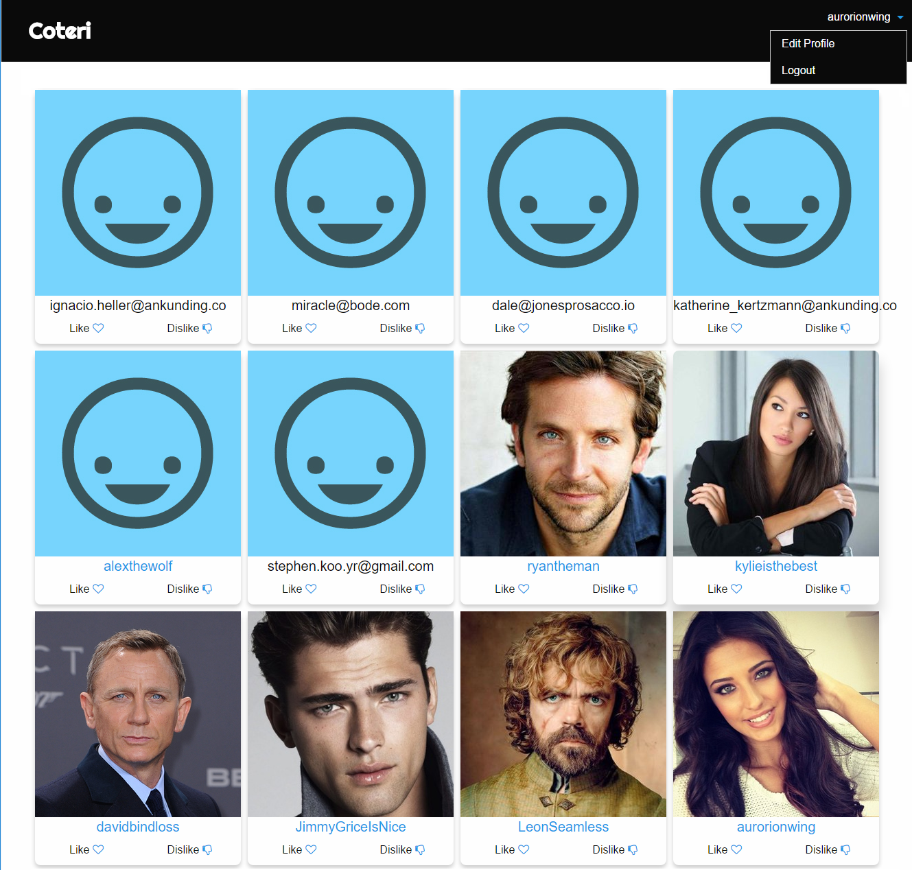

# Coteri

**A simple Tinder-like dating website built using Rails and PostgreSQL.**

View coterie at [https://coteri.herokuapp.com](https://coteri.herokuapp.com/).

## Features and tools
I built this basic social dating platform to try out a couple of things:

1. Responsive Pinterest-like masonry grids
2. Image upload functionality and profile pictures
3. Email confirmation functionality (using Devise)
4. Self-referential database models (i.e the User model) using `has_many, :through` relationships to record likes and dislikes between users
5. Using Devise for user accounts, login pages and user sessions
6. Deploying on Heroku
7. Using the slim templating engine instead of erb or pug.

## Database relationships
For this application, the User model contains usernames, emails, encrypted passwords as well as all the user profile details, including the `bio` and `avatar_file_name` (linked to the user profile picture).

Instead of `has_and_belongs_to_many` relation, I created an additional model for relationships
 `has_many, :through` in order to add context to each relationship.

This is how the relationships table looks:

| id | liker_id | likee_id | relation_type |                      |
| --:|:--------:|:--------:| -------------:| -------------------- |
| 1  | 15       | 39       | 1             | Represents a like    |
| 2  | 22       | 15       | -1            | Represents a dislike |
| 3  | 48       | 41       | 1             |                      |
